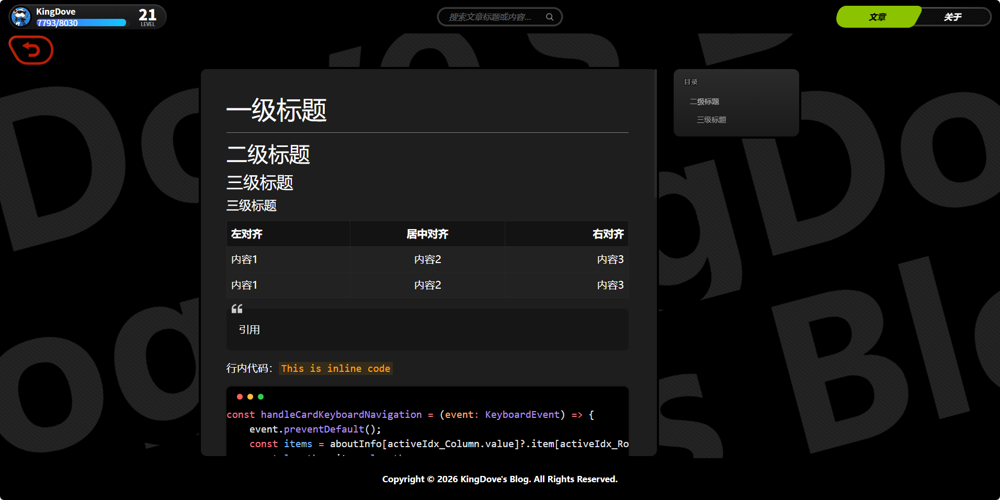
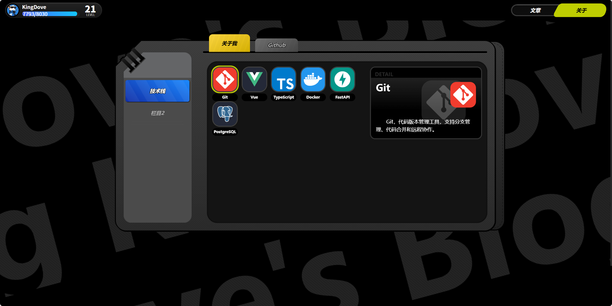
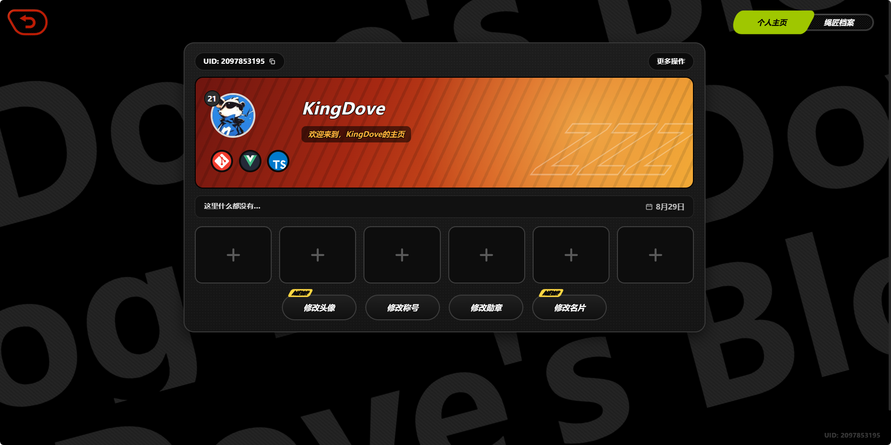

<div align="center">


[](https://astro.build)
[](https://www.typescriptlang.org)
[](https://tailwindcss.com)
[](https://developer.mozilla.org/docs/Web/Progressive_web_apps)
[](LICENSE)

**在线预览 → [blog.shumuxi.cfd](https://blog.shumuxi.cfd)**

</div>

## 这是什么

**Z-BLOG** 是一个以《绝区零》「绳网」为视觉原型的开源博客：复刻了绳网的卡片瀑布流、快速手册、代理人档案等界面语言，同时是一个功能完整的现代静态博客。

v2.0 使用 **Astro** 全面重构：所有页面在构建期生成为纯静态 HTML，浏览器里不加载任何前端框架运行时，构建产物只有 HTML / CSS 和少量原生 JS。

> v1 基于 Vue3 + Nuxt 开发，见 [参考项目](#参考项目) 中的 [z-blog](https://github.com/Yang-ZhiHang/z-blog)。

## 页面预览

| 文章列表（瀑布流） | 文章详情（目录 + 排版） |
| --- | --- |
|  |  |

| 关于页（快速手册） | 代理人档案 |
| --- | --- |
|  |  |

## 功能特性

**内容与渲染**

- Astro Content Collections 管理文章，zod schema 校验 frontmatter
- Markdown 全功能渲染：Shiki 构建期代码高亮（不随客户端下发任何高亮 JS）、KaTeX 数学公式、GFM 表格 / 任务列表
- 构建期读取本地图片固有尺寸写入 `width` / `height`（消除布局抖动），配合懒加载与异步解码
- 构建期统计字数与阅读时长（中英文混排口径：中文按字、英文按词）

**阅读体验**

- 绳网风格界面：斜切平行四边形导航高亮、胶囊按钮、大字水印背景、快速手册、代理人档案
- 文章瀑布流列表，封面懒加载 + 加载动画
- 文章详情页左文右目录的双滚动面板，目录与正文滚动联动
- 站内搜索：构建期注入索引（标题 + 正文），前端即时过滤、命中关键词高亮、方向键选择
- 文章图片点击放大预览
- PWA：可安装到桌面，预缓存构建产物 + 页面 NetworkFirst 运行时缓存，支持离线阅读

**站点工程**

- 站点信息集中配置（`src/config/site.ts`）：站点名、域名、作者信息等改一处全局生效
- RSS 订阅、sitemap、canonical、JSON-LD 结构化数据开箱即用
- 部署配置内置：GitHub Pages（Actions 工作流）、Netlify、Vercel 三平台即推即用
- ESLint + `astro check` 静态检查

## 快速开始

环境要求：Node.js 20+、pnpm 10。

```bash
# 1. 安装依赖
pnpm install

# 2. 本地开发（http://localhost:4321）
pnpm dev

# 3. 构建与本地预览产物
pnpm build
pnpm preview
```

| 命令 | 说明 |
| --- | --- |
| `pnpm dev` | 启动开发服务器 |
| `pnpm build` | 构建生产产物到 `dist/` |
| `pnpm preview` | 本地预览构建产物 |
| `pnpm check` | `astro check` 类型与语法检查 |
| `pnpm lint` | ESLint 检查 |

## 写文章

在 `src/content/articles/` 下新建 Markdown 文件即可，frontmatter 字段由 schema 自动校验：

```markdown
---
id: 15
title: 文章标题
description: 文章摘要（用于列表卡片与搜索结果）
createTime: '2026-08-29 12:00:00'
modifiedTime: '2026-08-29 12:00:00'
cover: ['/img/封面图.webp']
tags: ['标签']
categories: ['分类']
---

正文支持 GFM 全语法、Shiki 代码高亮与 KaTeX 数学公式（`$...$` 行内、`$$...$$` 独立公式块）。
```

## 站点配置

站点信息集中在 `src/config/site.ts`，一处修改、全局生效（页脚、PWA 清单、RSS、SEO 均从此读取）：

```ts
export const siteConfig = {
    site: 'https://example.com',     // 部署域名（勿带尾斜杠）
    lang: 'zh-CN',
    blogName: 'KingDove的个人博客',
    description: '欢迎来到KingDove的个人博客',
    foundedYear: 2024,               // 建站年份
    copyrightYear: 2026,             // 页脚版权年份
    author: authorInfo,              // 作者信息（名字/头像/邮箱/UID/生日）
} as const;
```

## 项目结构

```
├── assets/readme/           # README 演示图
├── public/                  # 静态资源（图片、站点图标、PWA 图标）
├── scripts/                 # Node 脚本（PWA 图标生成）
├── src/
│   ├── components/          # 界面组件（头部、文章卡、快速手册…）
│   ├── config/site.ts       # 站点集中配置（换壳改这里）
│   ├── content/articles/    # Markdown 文章（Content Collections）
│   ├── layouts/             # BaseLayout（SEO / PWA / 全局结构）
│   ├── lib/                 # 构建期工具（文章统计、图片尺寸插件）
│   ├── pages/               # 路由（列表 / 详情 / 关于 / 档案 / RSS / 404）
│   ├── scripts/             # 前端交互（瀑布流、目录、搜索…原生 TS）
│   └── styles/              # LESS 样式（Tailwind 管工具类，LESS 管定制样式）
└── astro.config.mjs         # Astro 配置（Markdown / PWA / sitemap）
```

## 部署

- **GitHub Pages**：仓库已内置 [`.github/workflows/deploy.yml`](.github/workflows/deploy.yml)，在仓库设置中将 Pages 来源改为 GitHub Actions 后，push 到 `master` 即自动构建部署。
- **Netlify / Vercel**：仓库内置 [`netlify.toml`](netlify.toml) 与 [`vercel.json`](vercel.json)，导入仓库即可部署。

> 记得把 `src/config/site.ts` 中的 `site` 换成你自己的域名，RSS / sitemap / canonical 依赖它。

## 技术栈

- [Astro 5](https://astro.build) — 静态站点生成，零框架运行时
- [TypeScript](https://www.typescriptlang.org) — 全量类型检查（`astro check`）
- [Tailwind CSS 3](https://tailwindcss.com) + LESS — Tailwind 处理不需要语义化的工具类场景，高度定制的组件样式用 LESS 实现
- [vite-plugin-pwa](https://vite-pwa-org.netlify.app) — PWA 与离线缓存
- [Shiki](https://shiki.style) / [KaTeX](https://katex.org) — 构建期代码高亮与公式渲染

## 参考项目

本项目在开发过程中参考、使用了以下开源项目，感谢这些作者的付出：

- [Yang-ZhiHang/z-blog](https://github.com/Yang-ZhiHang/z-blog) — 本项目的前身（v1，Vue3 + Nuxt 实现）
- [YunYouJun/valaxy](https://github.com/YunYouJun/valaxy) — 静态博客框架，本项目站点集中配置（`site.ts`）的设计参考来源
- [KawaYiLab/InterKnot-Web](https://github.com/KawaYiLab/InterKnot-Web) — 以《绝区零》中绳网为原型的论坛前端，本项目界面风格的参考来源
- [oil-oil/beautify-github-readme](https://github.com/oil-oil/beautify-github-readme) — 本 README 的设计与编写方法论来源

## License

[Apache-2.0](LICENSE)
